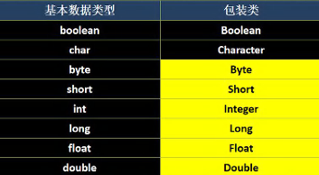
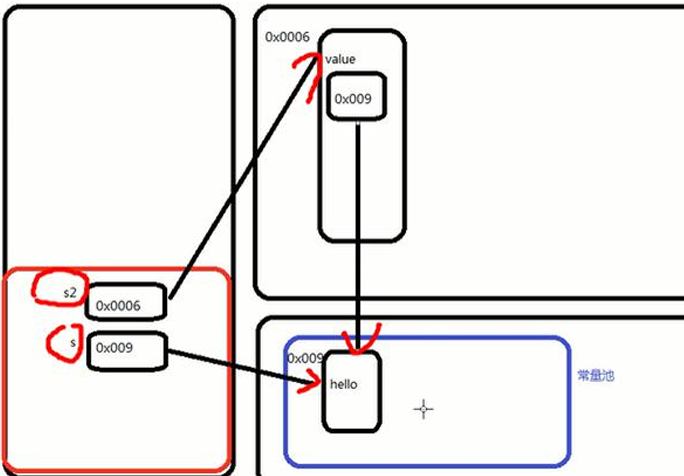

## 包装类
### 基本数据类型

### String类
String 类的理解和创建对象

创建String对象的两种方式
1. 直接赋值   String s = "dsb";
2. 调用构造器 String s = new String("dsb");

方式一：先从常量池查看是否有"dsb"数据空间，如果有，直接指向；如果没有则重新创建，然后指向。s最终指向的是常量池的空间地址。
方式二：现在堆中创建空间，里面维护了value属性，指向常量池的dsb空间。如果常量池没有"dsb"，则重新创建，如果有，直接通过value指向。最终指向的是堆中的空间地址。

```java
String a = "dsb";
String b = new String("dsb");
System.out.println(a.equals(b));    //T
System.out.println(a == b);         //F
System.out.println(a == b.intern());//T
```
当调用intern方法时，如果池中已经包含了一个等于此String对象的字符串(用equals(Object)方法确定)，则返回池中的字符串。否则，将此String对象添加到池中，并返回此Strig对象的引用。

#### 重要规则
String c1 = "ab" + "cd";常量相加，看的是池。
String c1 = a + b; 变量相加，是在堆中