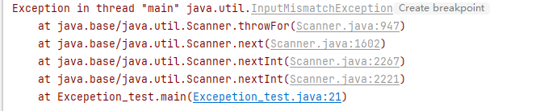

## 异常
```java
public class Excepetion_test {
    public static void main(String[] args) {
        int num1 = 10;
        int num2 = 0;

        try {
            int  res = num1/ num2;
        } catch (Exception e) {
            System.out.println("出现异常的原因" + e.getMessage());
        }

        System.out.println("程序继续运行");
    }
}
```

Java语言中，将程序执行中发生的不正常情况成为"异常"。（开发过程中的语法错误和逻辑错误不是异常）
**异常事件可以分为两大类**
- Error（错误）：Java虚拟机无法解决的严重问题。如：JVM系统内部错误、资源耗尽等严重错误。比如：StackOverflowError[栈溢出]和OOM(out of memory)，Error是严重错误，程序会崩溃。
- Exception: 其他因编程错误或偶然的外在因素导致的一般性问题，可以使用针对性的代码进行处理。例如空指针访问，试图读取不存在的文件，网络连接中断等等，
  - Exception分为两大类：**运行时异常**【程序运行时，发生的异常】和**编译时异常**【编程时，编译器检查出的异常】。

```
java.lang.Object
   └── java.lang.Throwable  （所有“可抛出”的顶层父类）
        ├── java.lang.Error                （严重错误：通常不建议捕获）
        │     ├── VirtualMachineError
        │     │     ├── OutOfMemoryError
        │     │     └── StackOverflowError
        │     ├── LinkageError
        │     └── AssertionError
        │
        └── java.lang.Exception  （异常：程序可处理/可恢复的情况）这类异常很普遍，可以不用全部处理
              ├── java.lang.RuntimeException        （运行时异常：非受检 Unchecked）
              │     ├── NullPointerException                    空指针异常
              │     ├── IndexOutOfBoundsException               
              │     │     ├── ArrayIndexOutOfBoundsException    数组下标越界异常
              │     │     └── StringIndexOutOfBoundsException   
              │     ├── ClassCastException                      类型转换异常
              │     ├── ArithmeticException                     数学运算异常
              │     ├── IllegalArgumentException
              │     │     └── NumberFormatException             数字格式不正确异常
              │     └── IllegalStateException
              │
              └── （其他 Exception：受检 Checked，必须处理）(就是编译时异常)
                    ├── IOException                             操作文件时，发生的异常
                    │     ├── FileNotFoundException             
                    │     └── EOFException
                    ├── SQLException                            操作数据库时，查询表可能发生的异常
                    ├── ClassNotFoundException                  加载类，而该类不存在时异常
                    ├── InterruptedException
                    └── ParseException

```

### 异常处理
当异常发生时，对异常处理的方式。
1. try-catch-finally 程序员在代码中捕获发生的异常，自行处理
2. thows             将发生的异常抛出，交给调用者（方法）来处理，最顶级的处理者是JVM

```java
try {
    代码/可能存在异常
}catch(Exception e) {
    // 捕获到异常
    // 当异常发生时，系统将异常封装乘Exception对象e，传递给catch
    // 得到异常对象后，程序员，自己处理
    // 如果没有发生异常
    //catch代码块不会执行
} finally {
    // 不管异常是否发生，finally必须执行
    // 所以这里一般释放资源
}
```

可以有多个catch语句，捕获不同的异常（进行不同的业务处理），要求**父类异常在后，子类异常在前**，比如（Exception在后，NullPointException 在前）如果发生异常，只会匹配一个catch

书写代码如何判断应该catch哪个异常？编译器会报错，直接看编译抛出的是什么错误即可。


### throws异常处理
1. 如果一个方法中可能生成某种异常，但是并不能确定如何处理这种异常，则此方法应显示声明抛出异常，表明该方法将不对这些异常进行处理，而由该方法的**调用者负责处理**。
2. 在方法声明中用throws语句可以声明抛出异常的列表，throws后面的异常类型可以是方法中产生的异常类型，也可以是它的父类。 

子类重写父类方法时，对抛出异常的规定：子类重写的方法，所抛出的异常类型要么和父类抛出的异常一致，要么为父类抛出的异常的类型的子类型。

**在throws过程中，如果有方法try-catch，就相当于处理异常，就可以不需要throws，否则别的方法调用这个方法也要throws**

### 自定义异常
1. 当程序中出现了某些“错误”，但该错误信息并没有在Throwable子类中描述处理，这个时候可以自己设计异常类，用于描述该错误信息。

定义类：自定义异常类名 继承Exception或RuntieException
如果继承Exception，属于编译异常
如果继承RuntimeException，属于运行异常（一般来说，继承RuntimeException）
举例：
```java
class AgeException extends RuntimeException {
    public AgeException(String message) {
        super(message);
    }
}
```

