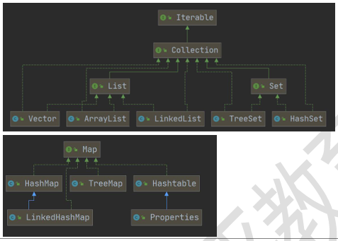

## 集合的框架体系
Java的集合类很多，主要分为两大类
Collection和Map

### Collection接口和常用方法
1. Collection实现子类可以存放多个元素，每个元素可以是Object
2. 有些Collection的实现类，可以存放重复的元素，有些不可以
3. 有些Collection的实现类，有些是有序的（List），有些不是有序（Set）
4. Collection接口没有直接的实现子类，是通过它的子接口Set和List来实现的。