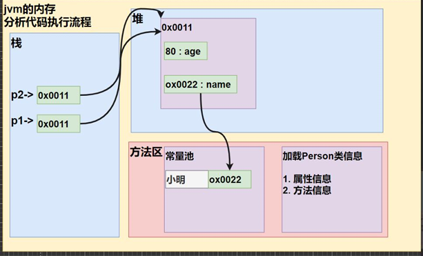
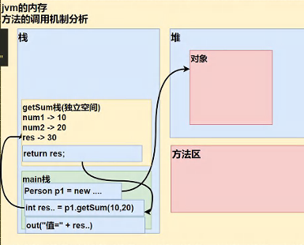
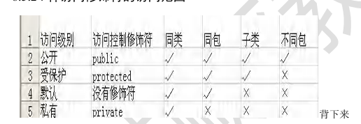

## 面向对象
### 类和对象的内存分配机制
1. Java内存的结构分析
   a. 栈： 一般存放基本数据类型（局部变量）
   b. 堆： 存放对象（Cat cat, 数组等）
   c. 方法区: 常量池（常量，比如字符串），类加载信息

   

2. 方法的调用机制
   a. 当程序执行到方法时，就会开辟一个独立的空间（栈空间）
   b. 当方法执行完毕，或者执行到return语句时，就会返回
   c. 返回到调用方法的地方
   d. 返回后，继续执行方法后面的代码
   e. 当main方法（栈）执行完毕，整个程序退出


**方法的传参机制：**
1. 对于基本数据类型，传递的是值拷贝，形参的任何改变不会影响实参！
2. 引用类型传递的是地址（传递也是值，但是值是地址），可以通过形参影响实参。


### 方法重载(OverLoad)
java中允许同一个类中，多个同名方法的存在，但要求形参列表不一致。

**可变参数**
允许将同一个类中多个同名同功能但参数个数不同的方法，封装成一个方法。**只能出现一个可变参数**
```java
public void f1 (int... nums)
public String showScore(String name, double... scores)
```

### 访问修饰符
Java 提供四种访问控制修饰符号，用于控制方法和属性（成员变量）的访问权限（范围）：
public
protected
默认
private



### 面向对象编程的三大特征
#### 封装
封装就是把抽象出的数据[属性]和对数据的操作[方法]封装在一起，数据被保护在内部，程序的其他部分只有通过被授权的操作[方法]，才能对数据进行操作

#### 继承
继承可以解决代码复用，让我们的编程更加靠近人类思维，当多个类存在相同的属性（变量）和方法时，可以从这些类中抽象出父类，在父类中定义这些相同的属性和方法，所有的子类不需要重新定义这些属性和方法，只需要通过extends来声明继承父类即可。

**super关键字**
1. 访问父类的属性，但不能访问父类的private属性
2. 访问父类的方法，但不能访问父类的private方法

重写(Override)
子类中的方法和父类的某一个方法名称、返回类型、参数一样，则子类的方法覆盖了父类的方法。

1. 子类方法的形参，列表，方法名称，要和父类的形参了列表，方法名称完全一样
2. 子类方法的返回类型和父类方法返回类型一样，或者是父类返回类型的子类
3. 子类方法不能缩小父类方法的访问权限

#### 多态
方法或对象具有多种形态。是面向对象的三大特征，多态是建立在封装和继承基础至上的。

一个对象的编译类型和运行类型可以不一致
编译类型在定义对象时，就确定了，不能改变
运行类型是可以变化的
编译类型看定义时=号的左边，运行类型看=号的右边。

***多态的向上转型***
本质：父类的引用指向了子类的对象
语法：父类类型 引用名 = new 子类类型()
特点：编译类型看左边，运行类型看右边。
可以调用父类中所有的成员（需遵循访问权限）
不能调用子类中特有的成员
**最终运行效果看子类的具体实现！**

***多态向下转型***
语法: 子类类型 引用名 = （子类类型） 父类引用
只能强转父类的引用，不能强转父类的对象
要求父类的引用必须指向的是当前目标类型的对象
当向下转型后，可以调用子类类型中所有的成员

instanceOf 比较操作符，用于判断对象的运行类型是否为XX类型或者XX类型的子类型

#### finalize方法
1. 对象被回收时，系统自动调用该对象的finalize方法。子类可以重写该方法，做一些释放资源的操作。
2. 什么时候被回收：当某个对象没有任何引用时，则jvm就认为这个对象是一个垃圾对象，就会使用垃圾回收机制来销毁该对象，在销毁该对象前，会先调用finalize方法

### 类方法
类方法也叫做静态方法
形式如下：
访问修饰符 static 数据返回类型 方法名(){} [推荐把访问修饰符放在static前面]

```
创建子一个子类对象时（继承关系），他们的静态代码块，静态属性初始化，普通代码块，普通属性初始化，构造方法的调用顺序如下：
1. 父类的静态代码块和静态属性（优先级一样，按定义顺序执行）
2. 子类的静态代码块和静态属性（优先级一样，按定义顺序执行）
3. 父类的普通代码块和普通属性初始化（优先级一样，按定义顺序执行）
4. 父类的构造方法
5. 子类的普通代码块和普通属性初始化（优先级一样，按定义顺序执行）
6. 子类的构造方法
```

## 单例模式